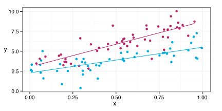

#### Course summary
The aim of this course is to provide fundamental statistical concepts and tools relevant to the practice of summarizing, analyzing, and visualizing data. This course will build your knowledge of the fundamental principles of biostatistical inference.  We will focus on linear regression and generalized linear regression models using a variety of examples and exercises from medical and public health research. 

---

#### Course Details

**Course number**: PUBHLTH 690NR 

**Instructor**: [Nicholas Reich](http://people.umass.edu/nick)

**Office hours**: Wed 9:30-10:30 or by appointment

**Prerequisites**:   
&nbsp; &nbsp; A first course in statistics or biostatistics. 
&nbsp; &nbsp; Familiarity with the [R statistical programming language](http://www.r-project.org).  
&nbsp; &nbsp; Working knowledge of basic matrix methods and calculus (optional, but recommended).

**Lectures**: Tu/Th, 11:15am&ndash;12:30pm, LGRC 204

**Required books** (all freely available online)  
&nbsp; &nbsp; Faraway JJ. 2002. [Practical Regression and Anova using R](http://cran.r-project.org/doc/contrib/Faraway-PRA.pdf).  
&nbsp; &nbsp; James G, Witten D, Hastie T, and Tibshirani R. 2014. [An Introduction to Statistical Learning](http://www-bcf.usc.edu/~gareth/ISL/).  
&nbsp; &nbsp; Diez D, Barr C, and &Ccedil;etinkaya-Rundel M. 2012. [OpenIntro Statistics, 2nd Ed.](http://www.openintro.org/stat/index.php)

**Recommended books**  
&nbsp; &nbsp; Weisberg S. 2005. *Applied Linear Regression, 3rd Edition*.  
&nbsp; &nbsp; Kutner M, Nachtsheim C, Neter J, and Li W. 2004. *Applied Linear Regression Models, 4th Edition*.  
&nbsp; &nbsp; Hosmer DW and Lemeshow S. 2000. *Applied Logistic Regression, 2nd Edition*.

---

The [source for the website](https://github.com/nickreich/stat-modeling-2015/tree/gh-pages) 